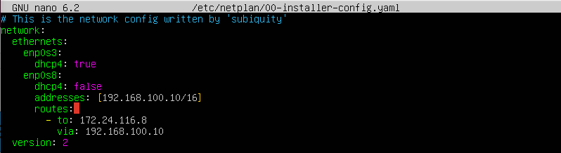
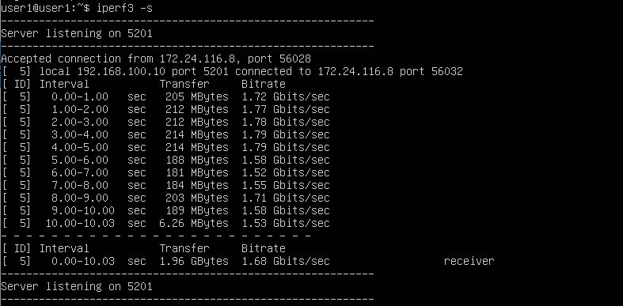
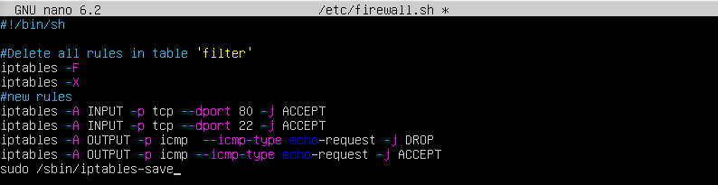
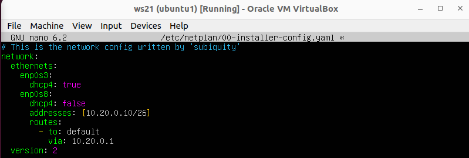
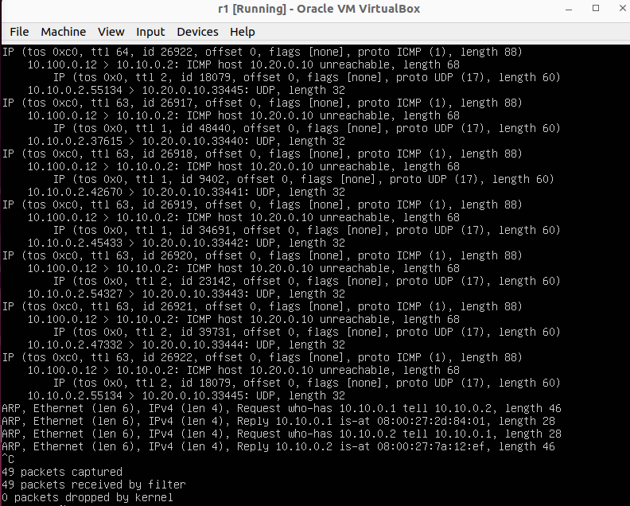
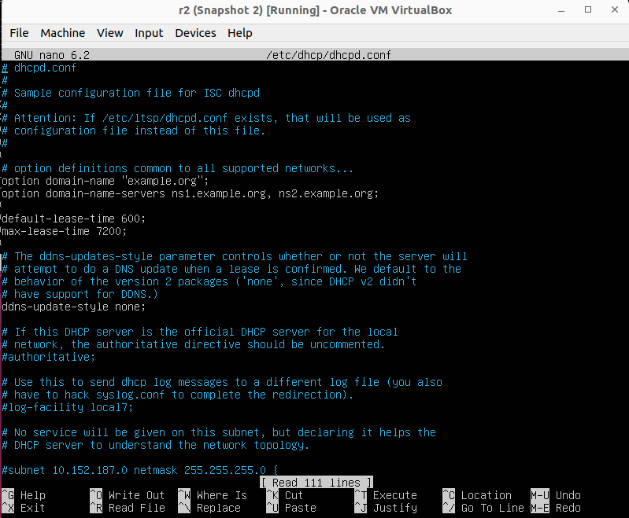
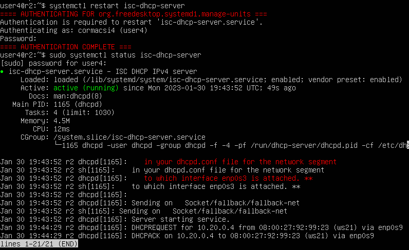

# Сети в Linux

Настройка сетей в Linux на виртуальных машинах.

## Contents

1. [Инструмент ipcalc](#part-1-инструмент-ipcalc)
2. [Статическая маршрутизация между двумя машинами](#part-2-статическая-маршрутизация-между-двумя-машинами)
3. [Утилита iperf3](#part-3-утилита-iperf3)
4. [Сетевой экран](#part-4-сетевой-экран)
5. [Статическая маршрутизация сети](#part-5-статическая-маршрутизация-сети)
6. [Динамическая настройка IP с помощью DHCP](#part-6-динамическая-настройка-ip-с-помощью-dhcp)
7. [Network Address Translation - NAT](#part-7-nat)
8. [Допополнительно. Знакомство с SSH Tunnels](#part-8-дополнительно-знакомство-с-ssh-tunnels)

## Part 1. Инструмент **ipcalc**

##### Поднять виртуальную машину (далее -- ws1)
`sudo apt install ipcalc`

#### 1.1. Сети и маски
Определить и записать в отчёт:
1) *Адрес сети **192.167.38.54/13**: `192.160.0.0/13`*


2) Перевод маски **255.255.255.0** в префиксную `/24` и двоичную запись `11111111.11111111.11111111.00000000`;
3) **/15** в обычную `255.254.0.0` и двоичную `11111111.11111110.00000000.00000000`;
4) **11111111.11111111.11111111.11110000** в обычную `255.255.255.240` и префиксную `/28`.


5) Минимальный и максимальный хост в сети *12.167.38.4* при масках:
```
  - /8:
  HostMin: _____ 12.0.0.1 00001100.00000000.00000000.00000001
  HostMax: 12.255.255.254 00001100.11111111.11111111.11111110
  - 11111111.11111111.00000000.00000000:
  HostMin: ___ 12.167.0.1 00001100.10100111.00000000.00000001
  HostMax: 12.167.255.254 00001100.10100111.11111111.11111110
  - 255.255.254.0:
  HostMin: __ 12.167.38.1 00001100.00000000.00000000.00000001
  HostMax: 12.167.39.254 00001100.11111111.11111111.11111110
  - /4:
  HostMin: _______ 0.0.0.1 00000000.00000000.00000000.00000001
  HostMax: 15.255.255.254 00001111.11111111.11111111.11111110
```


#### 1.2. localhost
Определить и записать в отчёт, можно ли обратиться к приложению, работающему на localhost, со следующими IP:
```
194.34.23.100 - нет,
127.0.0.2 - да,
127.1.0.1 - да,
128.0.0.1 - нет
```


 

#### 1.3. Диапазоны и сегменты сетей
Определить и записать в отчёт:
1) какие из перечисленных IP можно использовать в качестве публичного, а какие только в качестве частных:
```
10.0.0.45 - private,
134.43.0.2 - public,
192.168.4.2 - private,
172.20.250.4 - private,
172.0.2.1 - public,
192.172.0.1 - public,
172.68.0.2 - public,
172.16.255.255 - private,
10.10.10.10 - private,
192.169.168.1 - public
```


1) какие из перечисленных IP адресов шлюза возможны у сети 10.10.0.0/18:

```
10.0.0.1 - нет,
10.10.0.2 - да,
10.10.10.10 - да,
10.10.100.1 - нет,
10.10.1.255 - да
```

 

## Part 2. Статическая маршрутизация между двумя машинами

##### Поднять две виртуальные машины (далее -- ws1 и ws2)

##### С помощью команды `ip a` посмотреть существующие сетевые интерфейсы
- В отчёт поместить скрин с вызовом и выводом использованной команды `ip a` на двух виртуальных машинах:


- Чтобы получить такую же картинку, стоит упомянуть о добавлении второго адаптера, который выступит `enp0s8` для обеих виртуальных машин и еще третьего `enp0s9` для ws2. Выключаем машины и заходим в *Settings*, далее *Network* ---> *Adapter 2*: `Enable Network Adapter` и `Attached to: Internal Network`.

##### Описать сетевой интерфейс, соответствующий внутренней сети, на обеих машинах и задать следующие адреса и маски: ws1 - *192.168.100.10*, маска */16*, ws2 - *172.24.116.8*, маска */12*
- Проверяем существующие настройки командой `ip route` или `netstat -nr`.


- Используем команду `sudo nano /etc/netplan/00-installer-config.yaml` и дописываем изменения в файл *dhcp4: no* и *addresses: [...]*.


##### Выполнить команду `netplan apply` для перезапуска сервиса сети
- Вводим команду `sudo netplan apply` для применения изменений и проверяем изменения командами: `netstat -nr` или `ip route`.


- Далее проверяем изменения и настройки командой `ip a`


#### 2.1. Добавление статического маршрута вручную
##### Добавить статический маршрут от одной машины до другой и обратно при помощи команды вида `ip r add`


##### Пропинговать соединение между машинами
- `ping -c 5 172.24.116.8`


- `ping -c 5 192.168.100.10`


#### 2.2. Добавление статического маршрута с сохранением
##### Перезапустить машины
##### Добавить статический маршрут от одной машины до другой с помощью файла */etc/netplan/00-installer-config.yaml*
Переходим в файл и делаем изменения `sudo nano /etc/netplan/00-installer-config.yaml`:
- первая машина



- вторая машина


##### Пропинговать соединение между машинами

- `ping -c 5 172.24.116.8`


- `ping -c 5 192.168.100.10`


## Part 3. Утилита **iperf3**

*В данном задании используются виртуальные машины ws1 и ws2 из Части 2*

#### 3.1. Скорость соединения
##### Перевести и записать в отчёт: 8 Mbps в MB/s, 100 MB/s в Kbps, 1 Gbps в Mbps

- 8 Mbps (мегабит в секуду) = 1 MB/s (мегабайт в секунду)
- 100 MB/s (мегабайт в секунду) = 800 000 Kbps (килобит в секунду)
- 1 Gbps (гигабит в секунду) = 1 000 Mbps (мегабит в секунду)

#### 3.2. Утилита **iperf3** 
Устанавливаем необходимое дополнение: `sudo apt install iperf3`
##### Измерить скорость соединения между ws1 и ws2
- Запускаем команду на первой машине в режиме сервер с флагом -s: `iperf3 -s`. Она будет ожидать пока не запустится этаже команда на второй машине в режиме клиента.



- Одновременно запускаем команду `iperf3 -c 192.168.100.10`:


## Part 4. Сетевой экран
После соединения машин, перед нами стоит следующая задача: контролировать информацию, проходящую по соединению. Для этого используются сетевые экраны.

*В данном задании используются виртуальные машины ws1 и ws2 из Части 2*

#### 4.1. Утилита **iptables**
##### Создать файл */etc/firewall.sh*, имитирующий фаерволл, на ws1 и ws2:
```shell
#!/bin/sh

# Удаление всех правил в таблице "filter" (по-умолчанию).
iptables –F
iptables -X
```
##### Нужно добавить в файл подряд следующие правила:
1) на ws1 применить стратегию когда в начале пишется запрещающее правило, а в конце пишется разрешающее правило (это касается пунктов 4 и 5)
2) на ws2 применить стратегию когда в начале пишется разрешающее правило, а в конце пишется запрещающее правило (это касается пунктов 4 и 5)
3) открыть на машинах доступ для порта 22 (ssh) и порта 80 (http)
4) запретить *echo reply* (машина не должна "пинговаться”, т.е. должна быть блокировка на OUTPUT)
5) разрешить *echo reply* (машина должна "пинговаться")
##### В отчёт поместить скрины с содержанием файла */etc/firewall* для каждой машины:
- первая машина:



- вторая машина:


##### Запустить файлы на обеих машинах командами `sudo chmod +x /etc/firewall.sh` и `sudo bash /etc/firewall.sh`

- В отчёт поместить скрины с запуском обоих файлов:


- В отчёте описать разницу между стратегиями, применёнными в первом и втором файлах:

Разница между стратегиями, применёнными в первом и втором файлах, заключается в том, что на первой машине первым указано запрещающее правило на выход `OUTPUT DROP`, поэтому она не сможет пропинговать другую машину. У второй машины, наоброт - первым указано разрешающее правило `OUTPUT ACCEPT`, значит она сможет пропинговать другую машину. 

#### 4.2. Утилита **nmap**
##### Командой **ping** найти машину, которая не "пингуется"
Результат повторного пинга после настроек:


##### После чего утилитой **nmap** показать, что хост машины запущен. Для начала устанавливаем пакет `sudo apt install nmap`.
Далее пишем команду `nmap 172.24.116.8`: в выводе nmap должно быть сказано - `Host is up`.


##### Сохранить дампы образов виртуальных машин
- Сначала переходим в настройки виртуальной машины и выбираем `Snapshorts`


- Далее видим дополнительное меню, где выбираем `Take`.


- Видим результат сохранения дампов на одной машине, затем на другой:


**p.s. Ни в коем случае не сохранять дампы в гит!**

## Part 5. Статическая маршрутизация сети

`-` Пока что мы соединяли всего две машины, но теперь пришло время для статической маршрутизации целой сети.


##### Поднять пять виртуальных машин (3 рабочие станции (ws11, ws21, ws22) и 2 роутера (r1, r2))
На каждой машине произвести правильные настройки. Обращая внимание на вышеуказанную карту и количество связей от каждой из них: например, у машин с именами `ws11`, `ws21` и `ws22` должны быть установлены дополнительные сети.

- переходим в Настройки выключенной машины `Settings`,
- затем выбираем вкладку `Network`, где `Adapter 1` остается как есть,


- подключаем `Adapter 2` на `Internal Network` на все пять машин *ws11, ws21, ws22, r1, r2*,


- также необходимо подключить `Adapter 3` на r1 и r2:


##### А также установить все необходимые пакеты: 
- `sudo apt install ipcalc -y`
- `sudo apt install net-tools -y`
- `sudo apt install iperf3 -y`
- `sudo apt install nmap -y`
- `sudo apt install iptables -y`
- `sudo apt install tcpdump -y`
- `sudo apt install openssh-server -y`
- `sudo apt install traceroute -y`
- `sudo apt install isc-dhcp-server -y`
- `sudo apt install apache2 -y`
- `sudo apt install telnet -y`

>После установки всех пакетов и апгрейда дополнений необходимо отключить интернет на всех машинах сразу или до пункта 6.1 (как сделала я). Смотри, как отключить интернет в пункте 6.

##### Установливаем соответствующие имена на все пять машин: 
- `sudo hostnamectl set-hostname ws11`
- `sudo hostnamectl set-hostname ws21`
- `sudo hostnamectl set-hostname ws22`
- `sudo hostnamectl set-hostname r1`
- `sudo hostnamectl set-hostname r2`
- и перезагружаем каждую.

#### 5.1. Настройка адресов машин
##### Настроить конфигурации машин в *etc/netplan/00-installer-config.yaml* согласно сети на рисунке в начале пункта 5.

- `sudo nano /etc/netplan/00-installer-config.yaml`
- `sudo netplan apply`
- `ip -4 a`
- сделать настройки для каждой из пяти машин

##### Перезапустить сервис сети. Если ошибок нет, то командой `ip -4 a` проверить, что адрес машины задан верно.

- Настройки файла для ws21:


- Сохранение настроек и проверка заданного адреса машины:


- Настройки файла для ws22:


- Сохранение настроек и проверка заданного адреса машины:


- Настройки файла для ws11:


- Сохранение настроек и проверка заданного адреса машины:


- Настройки файла для r1:


- Сохранение настроек и проверка заданного адреса машины:


- Настройки файла для r2:


- Сохранение настроек и проверка заданного адреса машины:


##### Также пропинговать ws22 с ws21:
на ws22 запустить команду `ping -c 5 10.20.0.10`


##### Аналогично пропинговать r1 с ws11:
на r1 запустить команду `ping -c 5 10.10.0.2`


#### 5.2. Включение переадресации IP-адресов.
##### Для включения переадресации IP, выполните команду на роутерах:
- Вызываем команду `sudo sysctl -w net.ipv4.ip_forward=1` на r1


 <!-- (она будет ждать следующей команды на ws11) и получит отчет после завершения пинга: -->
- Вызываем команду `sudo sysctl -w net.ipv4.ip_forward=1` на r2


*При таком подходе переадресация не будет работать после перезагрузки системы.*
##### Откройте файл */etc/sysctl.conf*:
`sudo nano /etc/sysctl.conf` и добавьте в него следующую строку `net.ipv4.ip_forward = 1`
- Вызываем команду `sudo nano /etc/sysctl.conf` на r1


- Вызываем команду `sudo nano /etc/sysctl.conf` на r2


*При использовании этого подхода, IP-переадресация включена на постоянной основе.*

#### 5.3. Установка маршрута по-умолчанию
Пример вывода команды `ip r` после добавления шлюза:
```
default via 10.10.0.1 dev eth0
10.10.0.0/18 dev eth0 proto kernel scope link src 10.10.0.2
```
##### Настроить маршрут по-умолчанию (шлюз) для рабочих станций. Для этого добавить `default` перед IP роутера в файле конфигураций
`sudo nano /etc/netplan/00-installer-config.yaml`
- Изменить настройки для ws11 следующим образом:


- Изменить настройки для ws21 следующим образом:



- Изменить настройки для ws22 следующим образом:


- Изменить настройки для r1 следующим образом:


- Изменить настройки для r2 следующим образом:


##### Вызвать `ip r` и показать, что добавился маршрут в таблицу маршрутизации:
Сначала применяем изменения `sudo netplan apply`, затем проверяем появление нового маршрута `ip r` на каждой машине:
- ws11


- ws21


- ws22


- r1


- r2


##### Пропинговать с ws11 роутер r2 и показать на r2, что пинг доходит.
- Используем команду `ping -c 5 10.100.0.12`


- Для этого использовать команду: `sudo tcpdump -tn -i eth1`


#### 5.4. Добавление статических маршрутов
##### Добавить в роутеры r1 и r2 статические маршруты в файле конфигураций. Пример для r1 маршрута в сетку 10.20.0.0/26:
`sudo nano etc/netplan/00-installer-config.yaml`
- r1:
```shell
# Добавить в конец описания сетевого интерфейса eth1:
- to: 10.20.0.0
  via: 10.100.0.12
```

- r2:
```shell
# Добавить в конец описания сетевого интерфейса eth1:
- to: 10.10.0.0
  via: 10.100.0.12
```

`sudo netplan apply`
##### Вызвать `ip r` и показать таблицы с маршрутами на обоих роутерах.
>Пример таблицы на r1:
```
10.20.0.0/26 via 10.100.0.12 dev enp0s9 proto static
```

>Пример таблицы на r2:
```
10.10.0.0/18 via 10.100.0.11 dev enp0s9 proto static
```

##### Запустить команды на ws11:
>`ip r list 10.10.0.0/[маска сети]`

>`ip r list 0.0.0.0/0`


> Для адреса 10.10.0.0/18 был выбран маршрут, отличный от 0.0.0.0/0 (он попадает под маршрут по-умолчанию), т.к. машина ws11 соединена с сетью 10.10.0.0/18 по своему IP-адресу 10.10.0.2, для других адресов используется маршрут по умолчанию, который указан в файле 10.10.0.1.

#### 5.5. Построение списка маршрутизаторов
>`sudo apt install traceroute`

Пример вывода утилиты **traceroute** после добавления шлюза:
```
1 10.10.0.1 0 ms 1 ms 0 ms
2 10.100.0.12 1 ms 0 ms 1 ms
3 10.20.0.10 12 ms 1 ms 3 ms
```
##### Запустить на r1 команду дампа `tcpdump -tnv -i enp0s8`:


>По умолчанию tcpdump преобразует IP-адреса в имена хостов, а также использует имена служб вместо номеров портов.
- `n` Не преобразуйте адреса (например, адреса хостов, номера портов и т.д.) в имена.
- `t` Не печатайте временную метку в каждой строке дампа.
- `v` При синтаксическом анализе и печати создавайте (немного более) подробные выходные данные. Например, выводятся время жизни, идентификация, общая длина и параметры в IP-пакете. 
##### Вывод `tcpdump -tnv -i enp0s8`:

##### При помощи утилиты **traceroute** построить список маршрутизаторов на пути от ws11 до ws21:

- В отчёте, опираясь на вывод, полученный из дампа на r1, объяснить принцип работы построения пути при помощи **traceroute**.
  
>Принцип построения пути при помощи traceroute:  
Для определения промежуточных маршрутизаторов traceroute отправляет серию пакетов данных целевому узлу, при этом каждый раз увеличивая на 1 значение поля TTL («время жизни»). Это поле обычно указывает максимальное количество маршрутизаторов, которое может быть пройдено пакетом. 

>Первый пакет отправляется с TTL, равным 1, и поэтому первый же маршрутизатор возвращает обратно сообщение ICMP, указывающее на невозможность доставки данных. Traceroute фиксирует адрес маршрутизатора, а также время между отправкой пакета и получением ответа (эти сведения выводятся на монитор компьютера). Затем traceroute повторяет отправку пакета, но уже с TTL, равным 2, что позволяет первому маршрутизатору пропустить пакет дальше.

>Процесс повторяется до тех пор, пока при определённом значении TTL пакет не достигнет целевого узла. При получении ответа от этого узла процесс трассировки считается завершённым.

#### 5.6. Использование протокола **ICMP** при маршрутизации
##### Запустить на r1 перехват сетевого трафика, проходящего через eth0 с помощью команды:
`tcpdump -n -i eth0 icmp`


##### Пропинговать с ws11 несуществующий IP (например, *10.30.0.111*) с помощью команды:
`ping -c 1 10.30.0.111`


##### Сохранить дампы образов виртуальных машин


**p.s. Ни в коем случае не сохранять дампы в гит!**

## Part 6. Динамическая настройка IP с помощью **DHCP**

>Каждое устройство в сети на основе TCP/IP должно иметь уникальный IP-адрес одноадресной рассылки для доступа к сети и ее ресурсам. Без DHCP IP-адреса новых компьютеров или компьютеров, перемещаемых из одной подсети в другую, необходимо настроить вручную. IP-адреса для компьютеров, удаленных из сети, необходимо вручную освободить.

>При использовании DHCP весь процесс автоматизирован и управляется централизованно. DHCP-сервер поддерживает пул IP-адресов и арендованный адрес любому клиенту с поддержкой DHCP при запуске в сети. Так как IP-адреса являются динамическими (арендованными), а не статическими (без постоянного назначения), адреса, которые больше не используются, автоматически возвращаются в пул для перераспределения.

>`sudo apt install isc-dhcp-server`

##### Для r2 настроить в файле */etc/dhcp/dhcpd.conf* конфигурацию службы **DHCP**:
##### 1) указать адрес маршрутизатора по умолчанию, DNS-сервер и адрес внутренней сети. Пример файла для r2:
- `sudo nano /etc/dhcp/dhcpd.conf`




Дописать в файл следующие настройки:

```shell
subnet 10.100.0.0 netmask 255.255.0.0 {}

subnet 10.20.0.0 netmask 255.255.255.192
{
    range 10.20.0.2 10.20.0.50;
    option routers 10.20.0.1;
    option domain-name-servers 10.20.0.1;
}
```

##### 2) в файле *resolv.conf* прописать `nameserver 8.8.8.8`
- `sudo nano /etc/resolv.conf` открываем и дописываем строчку:


##### 3) перезагрузить службу **DHCP** командой `systemctl restart isc-dhcp-server`, затем проверить состояние/статус службы *isc-dhcp-server* :
- `sudo systemctl status isc-dhcp-server`



- в выводе смотрим, что состояние выделено зеленым цветом и активно, а так же внизу есть строчка `Server starting service`

##### 4) внести следующие настройки в `sudo nano /etc/netplan/00-installer-config.yaml` для обоих машин


##### 5) машину ws21 перезагрузить при помощи `reboot` и через `ip a` показать, что она получила адрес.

- `sudo netplan apply`
- `ip a`

- на машине ws21 проверяем выдачу адреса для enp0s8 `inet **ip** scope global dynamic enp0s8`


- на машине ws22 проверяем выдачу адреса для enp0s8 `inet **ip** scope global dynamic enp0s8`


##### Также пропинговать ws22 с ws21.
- на ws21 `ping -c 10 10.20.0.3`


### Отключение интернета
>*Перед тестированием рекомендуется отключить сетевой интерфейс **NAT** (его наличие можно проверить командой `ip a`) в VirtualBox, если он включен*
##### Для следующего задания потребуется отлючить интернет на всех пяти машинах, чтобы ничто не мешало соединению сетей. Поэтому выключаем машины и заходим в настройки `Settings`, далее `Network`, далее `Adapter 1` (который также является *enp0s3*), далее нажимаем галочку `Enable Network Adapter`, сохраняем примененные настройки и включаем машину. В файле `etc/netplan/00-installer-config.yaml` убираем прописанные настройки для `enp0s3`, сохраняем и применяем `sudo netplan apply`.


##### Указать MAC адрес у ws11, для этого в *etc/netplan/00-installer-config.yaml* надо добавить строки: `macaddress: 10:10:10:10:10:BA`, `dhcp4: true`
- выключаем машину и прописываем `MAC Address` в настройках для второго адаптера (который также является enp0s8):


- переходим в файл `sudo nano /etc/netplan/00-installer-config. yaml` и меняем настройки соответствующим образом:


- `sudo netplan apply` для применения изменений

##### Для r1 настроить аналогично r2, но сделать выдачу адресов с жесткой привязкой к MAC-адресу (ws11).
- на r1 `sudo nano /etc/dhcp/dhcpd.conf` и прописываем следующие настройки:


- на r1 `sudo nano /etc/resolv.conf`


- `systemctl restart isc-dhcp-server` и `sudo systemctl status isc-dhcp-server`


- смотрим, что мы получили динамический ip-адресс с помощью команды `ip a`, в выводе видим состояние `active` и `server starting service`


- проверяем соединение с помощью команды `ping`, где пингуем новый ip-адресс машин ws11 и ws22
- c ws22 на ws11


- c ws11 на ws22


- c ws11 на ws21


- c ws21 на ws11


##### Запросить с ws21 обновление ip адреса
- В отчёте поместить скрины ip до и после обновления.
- с ws21 `ip a` для проверки настоящего ip-адреса


- `sudo dhclient enp0s8 -r` для удаления
- `sudo dhclient enp0s8` для создания нового


- пингуем для проверки на ws22 `ping -c 10 10.20.0.4`


- В отчёте описать, какими опциями **DHCP** сервера пользовались в данном пункте.
>В части 6 были использованы опции DHCP протокола:
>- option routers ip-address [, ip-address...]; - адреса шлюзов для клиентской сети. Маршрутизаторы должны быть перечислены в порядке предпочтительности.
>- option domain-name-servers ip-address [, ip-address...]; - Список DNS серверов доступных клиенту. Сервера должны быть перечислены в порядке предпочтительности.

##### Сохранить дампы образов виртуальных машин


**p.s. Ни в коем случае не сохранять дампы в гит!**

## Part 7. **NAT**

*В данном задании используются виртуальные машины из Части 5*
##### В файле */etc/apache2/ports.conf* на ws22 и r1 изменить строку `Listen 80` на `Listen 0.0.0.0:80`, то есть сделать сервер Apache2 общедоступным:
- на ws22 `sudo nano /etc/apache2/ports.conf`


- на r1 `sudo nano /etc/apache2/ports.conf`


- В отчёт поместить скрин с содержанием изменённого файла.
##### Запустить веб-сервер Apache командой `service apache2 start`
- на ws22 `service apache2 start` и `sudo systemctl status isc-dhcp-server`


- на r1 `service apache2 start` и `sudo systemctl status isc-dhcp-server`


- В отчёт поместить скрины с вызовом и выводом использованной команды.
##### Добавить в фаервол, созданный по аналогии с фаерволом из Части 4, на r2 следующие правила:
>##### 1) Удаление правил в таблице filter - `iptables -F`
>##### 2) Удаление правил в таблице "NAT" - `iptables -F -t nat`
>##### 3) Отбрасывать все маршрутизируемые пакеты - `iptables --policy FORWARD DROP`
- перейти в файл `sudo nano /etc/firewall.sh` и установить вышеописанные настройки


- выполнить команды `sudo chmod +x /etc/firewall.sh` и `sudo bash /etc/firewall.sh` для применения


##### Проверить соединение между ws22 и r1 командой `ping`
*При запуске файла с этими правилами, ws22 не должна "пинговаться" с r1, видим в выводе `100% packet loss`. С ws22 пингуем r1 `ping -c 5 10.10.0.1`:*


##### Добавить в файл ещё одно правило:
##### 4) Разрешить маршрутизацию всех пакетов протокола **ICMP**
>iptables -A FORWARD -p icmp -j ACCEPT
- `sudo nano /etc/firewall.sh`


- выполнить команды `sudo chmod +x /etc/firewall.sh` и `sudo bash /etc/firewall.sh` для применения 
##### Проверить соединение между ws22 и r1 командой `ping`
*При запуске файла с этими правилами, ws22 должна "пинговаться" с r1* `ping -c 5 10.10.0.1`


##### Добавить в файл ещё два правила:

##### 5) Включить **SNAT**, а именно маскирование всех локальных ip из локальной сети, находящейся за r2 (по обозначениям из Части 5 - сеть 10.20.0.0). Смотреть далее.

*Совет: стоит подумать о маршрутизации внутренних пакетов, а также внешних пакетов с установленным соединением*

##### 6) Включить **DNAT** на 8080 порт машины r2 и добавить к веб-серверу Apache, запущенному на ws22, доступ извне сети.

*Совет: стоит учесть, что при попытке подключения возникнет новое tcp-соединение, предназначенное ws22 и 80 порту*
- `sudo nano /etc/firewall.sh`


- выполнить команды `sudo chmod +x /etc/firewall.sh` и `sudo bash /etc/firewall.sh` для применения

##### Запускать файл также, как в Части 4

##### Проверить соединение по TCP для **SNAT**, для этого с ws22 подключиться к серверу Apache на r1 командой:
`telnet [адрес] [порт]`
##### Проверить соединение по TCP для **DNAT**, для этого с r1 подключиться к серверу Apache на ws22 командой `telnet` (обращаться по адресу r2 и порту 8080)
`telnet 10.100.0.11 8080` с машины ws22


*Проверить подмену IP-адреса можно с помощью команды tcpdump - пингуем с машины ws22 роутер r1, в выводе tcpdump будет отображаться с какого адреса идет запрос - IP-адрес r2*


*Пингуем соединение с r2 `ping -c 5 10.100.0.11` и видим в отчете `0% packet loss`*


##### Сохранить дампы образов виртуальных машин


**p.s. Ни в коем случае не сохранять дампы в гит!**

## Part 8. Дополнительно. Знакомство с **SSH Tunnels**

*В данном задании используются виртуальные машины из Части 5*

##### Запустить на r2 фаервол с правилами из Части 7
- выполнить команды `sudo chmod +x /etc/firewall.sh` и `sudo bash /etc/firewall.sh` для применения


##### Запустить веб-сервер **Apache** на ws22 только на localhost (то есть в файле */etc/apache2/ports.conf* изменить строку `Listen 80` на `Listen localhost:80`)
- переходим в файл `sudo nano /etc/apache2/ports.conf` и меняем настройки


- запускаем сервис apache2 на ws22 командой `service apache2 start`


##### Воспользоваться *Local TCP forwarding* с ws21 до ws22, чтобы получить доступ к веб-серверу на ws22 с ws21
`ssh -L 8080:localhost:80 user2@10.20.0.3`


##### Для проверки, сработало ли подключение, перейдите во второй терминал (например, клавишами Alt + F2) и выполните команду:
`telnet 127.0.0.1 8080`


##### Воспользоваться *Remote TCP forwarding* c ws11 до ws22, чтобы получить доступ к веб-серверу на ws22 с ws11
`ssh -R 8080:localhost:80 user2@10.20.0.3`


##### Для проверки, сработало ли подключение, перейдите во второй терминал (например, клавишами Alt + F2) и выполните команду:
`telnet localhost 80`


##### Сохранить дампы образов виртуальных машин


**p.s. Ни в коем случае не сохранять дампы в гит!**
